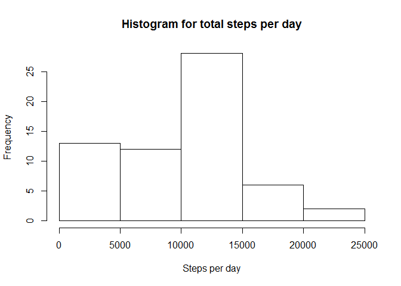
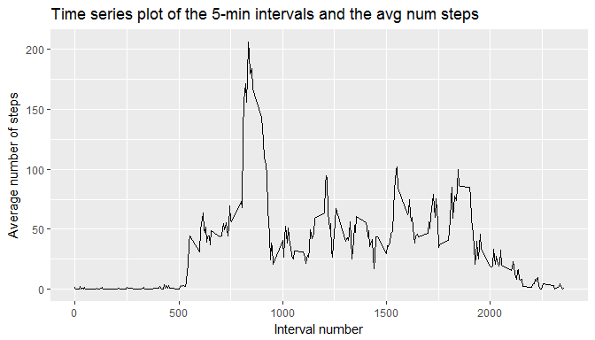
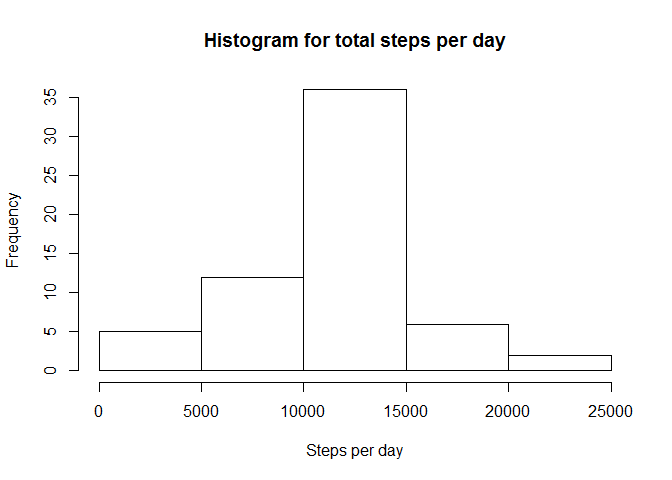
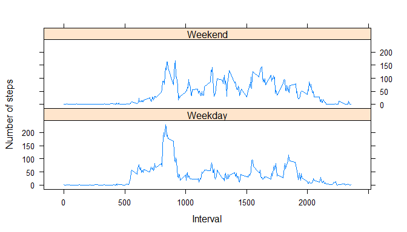

# Reproducible Research: Peer Assessment 1

Author: Jonathan Wharton
Date: 28Aug2017

Details: Summary analysis of activity data from personal activity monitoring device.

## Loading and preprocessing the data

Note: The working directory may need to be changed for this to work.


```r
#1. Load the data (i.e. read.csv())
unzip('activity.zip')
activity <- read.csv('activity.csv')

#2. Process/transform the data (if necessary) into a format suitable for your analysis
activity$date <- as.Date(activity$date)
```

## What is mean total number of steps taken per day?  


```r
#1. calculate total number of steps taken per day, ignoring missing values
library(dplyr)
```

```
## 
## Attaching package: 'dplyr'
```

```
## The following objects are masked from 'package:stats':
## 
##     filter, lag
```

```
## The following objects are masked from 'package:base':
## 
##     intersect, setdiff, setequal, union
```

```r
act_by_day <- activity %>% 
     group_by(date) %>%
     summarise(steps_day = sum(steps, na.rm=TRUE))

#2. Produce histogram
hist(act_by_day$steps_day,
     main='Histogram for total steps per day',
     xlab= 'Steps per day')
```

<!-- -->

```r
#3. Get mean and median for steps per day.
mean_steps <- mean(act_by_day$steps_day)
median_steps <- median(act_by_day$steps_day)
```
The mean steps per day is 9354.23.  
The median steps per day is 10395.  

## What is the average daily activity pattern?

```r
#1. Make a time series plot (i.e. type = "l") of the 5-minute interval (x-axis) and the average number of steps taken, averaged across all days (y-axis)
#first create summary dataset
by_interval <- activity %>% 
     filter(!is.na(steps)) %>%
     group_by(interval) %>%
     summarise(steps_interval = mean(steps))

#graph
library(ggplot2)
ggplot(by_interval, mapping = aes(interval,steps_interval)) + 
    geom_line() +
    xlab("Interval number") +
    ylab("Average number of steps") +
    ggtitle("Time series plot of the 5-min intervals and the avg num steps", subtitle = NULL)
```

<!-- -->


```r
#2. Which 5-minute interval, on average across all the days in the dataset, contains the maximum number of steps?
max_record <- by_interval %>%
    filter(steps_interval == max(steps_interval))

max_interval <- max_record$interval[1]
```
The interval with (on average) the maximum number of steps is interval 835.  

## Imputing missing values

```r
#1. Calculate and report the total number of missing values in the dataset (i.e. the total number of rows with NAs)
num_missing <- activity %>%
     filter(is.na(steps)) %>%
     nrow()
```
The number of missing values in the dataset are 2304. 

Imputation method chosen is filling missing values with mean for each interval.

```r
#2. Devise a strategy for filling in all of the missing values in the dataset. The strategy does not need to be sophisticated. For example, you could use the mean/median for that day, or the mean for that 5-minute interval, etc.
# Fill na with mean value for each interval

#3. Create a new dataset that is equal to the original dataset but with the missing data filled in.
day_mean <- activity %>%
  filter(!is.na(steps)) %>%
  group_by(interval) %>%
  summarise(mean_steps = mean(steps))

activity_nona <- inner_join(activity,day_mean, by="interval") 
activity_nona$steps <- ifelse(!is.na(activity_nona$steps), activity_nona$steps,activity_nona$mean_steps)
activity_nona<-activity_nona %>% select(steps,date,interval)

#calculate total number of steps taken per day, ignoring missing values
act_nona_by_day <- activity_nona %>% 
     filter(!is.na(steps)) %>%
     group_by(date) %>%
     summarise(steps_day = sum(steps))

#4. Make a histogram of the total number of steps taken each day and Calculate and report the mean and median total number of steps taken per day. Do these values differ from the estimates from the first part of the assignment? What is the impact of imputing missing data on the estimates of the total daily number of steps?

#histogram
hist(act_nona_by_day$steps_day,
     main='Histogram for total steps per day',
     xlab= 'Steps per day')
```

<!-- -->

```r
#mean and median total number of steps
mean_nona_steps <- mean(act_nona_by_day$steps_day)
median_nona_steps <- median(act_nona_by_day$steps_day)
```
The imputed mean steps per day is 10766.19.  
The imputed median steps per day is 10766.19.

The impact of imputing the data on the missing steps is increasing the total steps per day as shown by the increase in mean and median.  The histogram shows that this boost appears to affect days with 0-5000 steps where there is a reduction in the frequency, while a very similar increase in frequency of 10000-15000 steps per day takes place.


## Are there differences in activity patterns between weekdays and weekends?

```r
#1. Create a new factor variable in the dataset with two levels - "weekday" and "weekend" indicating whether a given date is a weekday or weekend day.
activity_wd_we <- activity_nona 
activity_wd_we$weekend <- as.factor(ifelse(weekdays(activity_wd_we$date) %in% c('Saturday', 'Sunday'),"Weekend","Weekday"))

#steps/interval
by_interval_wd_we <- activity_wd_we %>% 
  filter(!is.na(steps)) %>%
  group_by(weekend,interval ) %>%
  summarise(steps_interval = mean(steps))


library("lattice")
xyplot(steps_interval ~ interval | weekend,
       data = by_interval_wd_we,
       type = 'l',
       layout = c(1, 2),
       xlab = 'Interval',
       ylab = 'Number of steps')
```

<!-- -->
